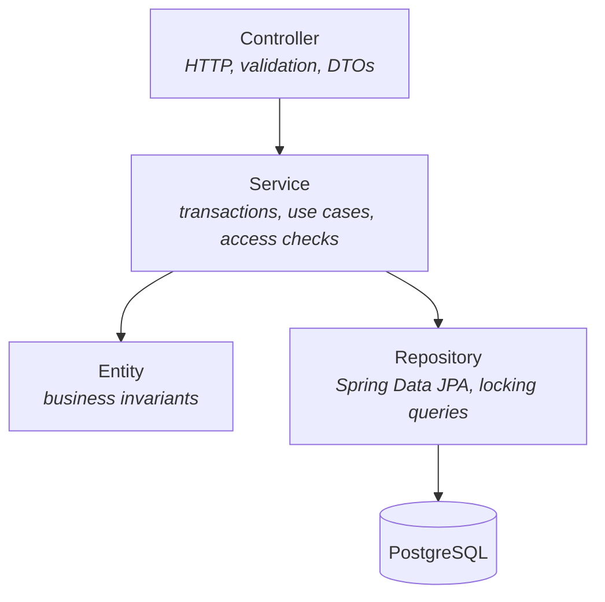
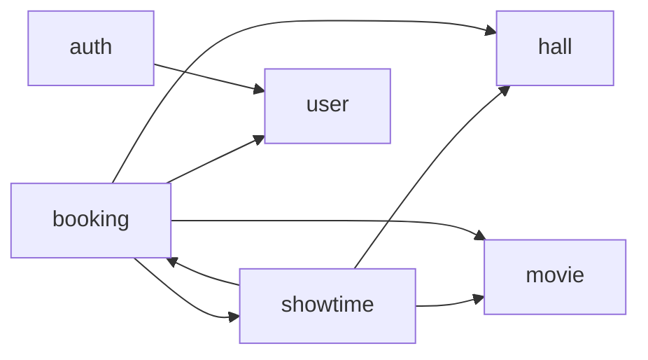

# Architecture

## Tech stack

| Concern | Choice |
|---|---|
| Language / runtime | Java 25 |
| Framework | Spring Boot 4.1.1 (Spring Framework 7, Spring Security 7) |
| Web | Spring Web MVC (`spring-boot-starter-webmvc`) |
| Persistence | Spring Data JPA + Hibernate, PostgreSQL 18 (`btree_gist` extension) |
| Schema migrations | Flyway (`ddl-auto: validate`: Hibernate never changes the schema) |
| Authentication | Spring Security OAuth2 Resource Server with a self-issued HS256 JWT |
| Validation | Jakarta Bean Validation |
| Scheduling | Spring `@Scheduled` (`HoldExpiryJob`), enabled by `SchedulingConfig` |
| Build | Maven (wrapper included: `mvnw` / `mvnw.cmd`) |
| Packaging | Multi-stage `Dockerfile` (JDK 25 build, JRE 25 runtime, non-root user) and `docker-compose.yml` |
| Monitoring | Spring Boot Actuator (`/actuator/health`, `/actuator/info`) |

## Layers

Each feature follows the same layering. Dependencies only point downward.



| Layer | Responsibility | Must not |
|---|---|---|
| **Controller** | Map HTTP to service calls, `@Valid` request DTOs, read the JWT into a `CurrentUser` | Contain business logic or return entities |
| **Service** | One public method per use case, `@Transactional` boundaries, ownership checks, load/lock entities, read the time from the `Clock` bean | Depend on HTTP or Spring Security types |
| **Entity** | Guard its own invariants (`Booking.pay`, `Booking.cancel`, `Showtime.checkOpenForSale`, ...) and throw domain exceptions | Know about repositories or other services |
| **Repository** | Data access, including `SELECT ... FOR UPDATE` and bulk `UPDATE` queries | Contain business rules |
| **DTO** (`dto/`) | Java `record`s for request/response bodies, with static `from(entity)` mappers | Be persisted |

## Package layout

The code is organized **by feature** (package-by-feature), not by technical layer:

```
com.devtraining.tickets
├── EventTicketsApplication        @SpringBootApplication + @ConfigurationPropertiesScan
├── config/
│   ├── SecurityConfig             filter chain, URL rules, JWT encoder/decoder, role mapping, PasswordEncoder
│   ├── JwtProperties              app.jwt.*     (validated @ConfigurationProperties record)
│   ├── AdminProperties            app.admin.*   (validated)
│   ├── BookingProperties          app.booking.* (limit, cancel cutoff, hold time, seat-gap rule)
│   ├── CinemaProperties           app.cinema.*  (time zone, cleaning time, check-in window)
│   ├── ClockConfig                Clock bean: the only source of "now"; tests replace it
│   ├── SchedulingConfig           @EnableScheduling
│   └── AdminAccountInitializer    creates the admin user on startup if missing
├── common/exception/
│   ├── ApiException               base class carrying an HttpStatus
│   ├── BadRequestException        400
│   ├── ForbiddenException         403
│   ├── NotFoundException          404
│   ├── ConflictException          409
│   └── GlobalExceptionHandler     @RestControllerAdvice → ProblemDetail JSON
├── auth/
│   ├── AuthController             /api/auth/register, /login, /me
│   ├── AuthService                registration (with optional date of birth), credential check, token issuing
│   ├── JwtService                 builds and signs the JWT
│   ├── CurrentUser                caller identity (id, email, role) extracted from the JWT
│   └── dto/                       RegisterRequest, LoginRequest, AuthResponse
├── user/
│   ├── User, Role                 entity (incl. dateOfBirth) + enum
│   ├── UserRepository
│   └── UserResponse
├── movie/
│   ├── Movie, AgeRating           entity + enum (G, PG13, R18 with minimum age)
│   ├── MovieRepository
│   ├── MovieService
│   ├── MovieController            /api/movies
│   └── dto/                       MovieRequest, MovieResponse
├── hall/
│   ├── Hall, Seat, SeatType       hall with its seat layout; SeatType holds the price multipliers
│   ├── HallRepository, SeatRepository
│   ├── HallService
│   ├── HallController             /api/halls
│   └── dto/                       HallRequest, HallResponse
├── showtime/
│   ├── Showtime, ShowtimeStatus   entity (sale window, "no move after sales", seat price) + enum
│   ├── ShowtimeRepository         includes findByIdForUpdate (pessimistic lock), overlap check
│   ├── ShowtimeService            endsAt, overlap check, seat map, cancel with cascade
│   ├── ShowtimeController         /api/showtimes, /api/showtimes/{id}/seats
│   └── dto/                       ShowtimeRequest, ShowtimeResponse, SeatMapResponse
└── booking/
    ├── Booking, BookingStatus     entity (hold, pay, cancel, check-in) + enum
    ├── BookingSeat                one seat in a booking, with its price and an "active" flag
    ├── BookingRepository          findByIdForUpdate, findShowtimeIdById, bulk expire/cancel
    ├── BookingSeatRepository      "taken seat" queries, bulk release
    ├── BookingService             booking rules: hold, pay, cancel, check-in, expire
    ├── HoldExpiryJob              @Scheduled sweep that expires unpaid holds
    ├── TicketCodeGenerator        random codes like K7QW-M2XP
    ├── BookingController          /api/bookings
    ├── TicketController           /api/tickets/{code}/check-in
    └── dto/                       BookingRequest, BookingResponse
```

To add a new feature, create a new top-level package with the same shape.

### Package dependencies



There is one **deliberate cycle** between `showtime` and `booking`:

- `booking` uses `ShowtimeRepository` to lock the showtime row and `Showtime` to check the sale window.
- `showtime` uses `BookingService.cancelAllForShowtime` / `hasActiveSeats` and `BookingSeatRepository` to count taken seats, because cancelling a showtime must cancel its bookings in the same transaction, and seat maps need to know which seats are taken.

Splitting this would need events or a third package, which is more machinery than this size of project needs. Keep the cycle to these calls; don't add more.

## Request flow: holding seats and paying

```mermaid
sequenceDiagram
    autonumber
    participant Client
    participant Security as Security filter chain
    participant Ctrl as BookingController
    participant Svc as BookingService
    participant DB as PostgreSQL

    Client->>Security: POST /api/bookings {showtimeId, seats} (Bearer JWT, optional Idempotency-Key)
    Security->>Security: verify signature, issuer, expiry → 401 if invalid
    Security->>Ctrl: authenticated request
    Ctrl->>Ctrl: @Valid BookingRequest → 400 if not 1..4 seats; check Idempotency-Key length
    Ctrl->>Svc: create(CurrentUser, request, key)
    Svc->>DB: BEGIN; SELECT showtime ... FOR UPDATE
    Svc->>DB: key already used by this user? → return that booking (replay)
    Svc->>DB: UPDATE old holds of this showtime → EXPIRED, seats inactive
    Svc->>Svc: sale open? age rating? seat labels valid? per-customer limit? seats free? no single-seat gap? → 400 / 403 / 404 / 409
    Svc->>DB: INSERT booking (HELD, hold_expires_at = now + hold time) + booking_seats (server prices)
    Svc->>DB: COMMIT
    Svc-->>Ctrl: BookingResponse
    Ctrl-->>Client: 201 Created + Location header

    Client->>Security: POST /api/bookings/{id}/pay (Bearer JWT)
    Security->>Ctrl: authenticated request
    Ctrl->>Svc: pay(CurrentUser, id)
    Svc->>DB: BEGIN; SELECT showtime_id FROM bookings (no lock)
    Svc->>DB: SELECT showtime ... FOR UPDATE
    Svc->>DB: SELECT booking ... FOR UPDATE
    Svc->>Svc: owner or admin? → 403; hold not expired, HELD, showtime not started/cancelled? → 409
    Svc->>DB: UPDATE booking → CONFIRMED, confirmed_at, ticket_code
    Svc->>DB: COMMIT
    Svc-->>Client: 200 BookingResponse with ticketCode
```

Payment is simulated: `pay` only confirms the booking. Cancelling (`POST /api/bookings/{id}/cancel`) follows the same lock steps as paying.

## Error handling

All errors use the [RFC 9457](https://www.rfc-editor.org/rfc/rfc9457) problem-detail format, produced by `GlobalExceptionHandler`:

| Source | Status |
|---|---|
| Bean validation failure (`MethodArgumentNotValidException`) | 400, with an `errors` map of field → message |
| Malformed JSON | 400 |
| `BadRequestException` (for example unknown or duplicate seat labels, bad `Idempotency-Key`) | 400 |
| `BadCredentialsException` (wrong login) | 401 |
| Missing/invalid token (from Spring Security, before reaching controllers) | 401 |
| `ForbiddenException` (not your booking, too young for the movie), `AccessDeniedException`, or wrong role for a URL | 403 |
| `NotFoundException` | 404 |
| `ConflictException` (seat taken, hold expired, sales closed, hall busy, ...) | 409 |
| Anything else | 500, logged; the client gets a generic message |

To add a new business error, throw one of the `ApiException` subclasses, or add a new subclass. No handler change is needed.

## Design decisions

- **Seats are rows, guarded by a partial unique index.** Instead of an `available_seats` counter, each booked seat is a `booking_seats` row. `ux_booking_seats_active (showtime_id, seat_id) WHERE active` means the database itself refuses to sell a seat twice. Releasing a seat just sets `active = false`, which keeps the history and lets the seat be sold again. See [Database → Constraints](database.md#constraints).
- **Hold, then pay.** A new booking is `HELD` for `app.booking.hold-duration` (default 10 minutes), so a customer can't lose seats between choosing and paying. Unpaid holds expire on their own: queries ignore them as soon as `hold_expires_at` passes, booking a showtime expires its old holds first, and `HoldExpiryJob` sweeps the rest every minute. The sweep is housekeeping, not a correctness requirement. See [Database → Expired holds](database.md#expired-holds).
- **One lock order: showtime, then booking.** Every write that touches a showtime's seats or bookings locks the showtime row first. Pay, cancel and check-in read the booking's showtime id without a lock, lock the showtime, then lock the booking. This makes concurrent writes for one showtime queue up, and it rules out deadlocks between customers cancelling and an admin cancelling the whole showtime. See [Database → Concurrency](database.md#concurrency-and-locking).
- **Pessimistic locking over optimistic locking.** Booking is a hot path where many customers compete for the same showtime. `SELECT ... FOR UPDATE` makes requests queue rather than fail and retry.
- **Idempotency keys.** Clients can send an `Idempotency-Key` header with `POST /api/bookings`. A retry with the same key (for example after a timeout) returns the first booking instead of holding more seats. Reusing a key for a different showtime or different seats is a client bug and gets 409. Keys are stored per user (`UNIQUE (user_id, idempotency_key)`), so one user's key can never return or block another user's booking.
- **A `Clock` bean for time.** Services never call `Instant.now()` for business rules; they ask the injected `Clock`. Unit tests pass a fixed clock, and integration tests swap in a `MutableClock` to expire holds or reach the start time without waiting. (The `@PrePersist` audit timestamps `created_at` / `updated_at` still use the system time.)
- **Business rules in entities.** `Showtime.checkOpenForSale()`, `Showtime.update()` (no moving a showtime after sales), `Booking.pay()`, `Booking.cancel()` and `Booking.checkIn()` enforce invariants wherever they are called from, and are easy to unit test.
- **Prices come from the server.** `BookingRequest` has no price field. Each seat's price is `base_price × SeatType multiplier`, copied into `booking_seats.price` so later price changes don't affect sold tickets.
- **Overlapping showtimes are blocked twice.** `ShowtimeService` checks for overlap to give a clear message, and the `ex_showtimes_hall_overlap` exclusion constraint catches two admins scheduling the same hall at the same moment.
- **Self-issued JWT with Spring's resource-server support.** The app needs no third-party JWT library or custom auth filter: Spring Security validates tokens with `NimbusJwtDecoder`.
- **`open-in-view: false`.** Lazy loading outside transactions is disabled. Services map entities to DTOs inside the transaction and use `@EntityGraph` where related data is needed.
- **Flyway owns the schema.** Hibernate only validates it, so schema changes are reviewed SQL with history.
