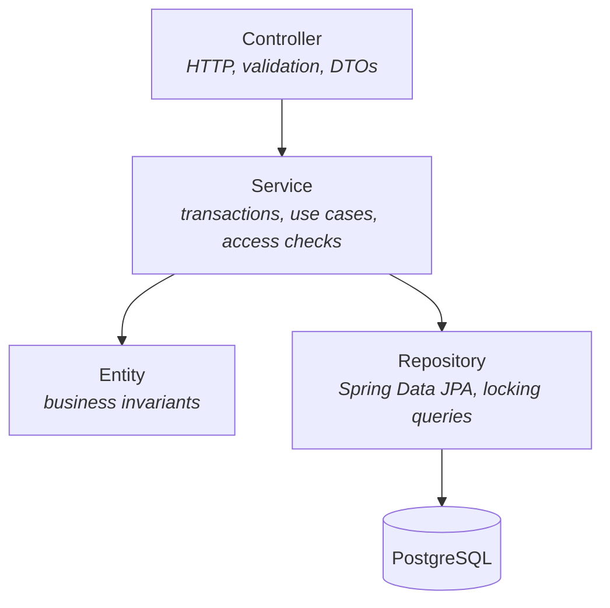

# Architecture

## Tech stack

| Concern | Choice |
|---|---|
| Language / runtime | Java 25 |
| Framework | Spring Boot 4.1.1 (Spring Framework 7, Spring Security 7) |
| Web | Spring Web MVC (`spring-boot-starter-webmvc`) |
| Persistence | Spring Data JPA + Hibernate, PostgreSQL |
| Schema migrations | Flyway (`ddl-auto: validate`: Hibernate never changes the schema) |
| Authentication | Spring Security OAuth2 Resource Server with a self-issued HS256 JWT |
| Validation | Jakarta Bean Validation |
| Build | Maven (wrapper included: `mvnw` / `mvnw.cmd`) |
| Monitoring | Spring Boot Actuator (`/actuator/health`, `/actuator/info`) |

## Layers

Each feature follows the same layering. Dependencies only point downward.



| Layer | Responsibility | Must not |
|---|---|---|
| **Controller** | Map HTTP to service calls, `@Valid` request DTOs, read the JWT into a `CurrentUser` | Contain business logic or return entities |
| **Service** | One public method per use case, `@Transactional` boundaries, ownership checks, load/lock entities | Depend on HTTP or Spring Security types |
| **Entity** | Guard its own invariants (`reserveSeats`, `cancel`, ...) and throw domain exceptions | Know about repositories or other services |
| **Repository** | Data access, including `SELECT ... FOR UPDATE` queries | Contain business rules |
| **DTO** (`dto/`) | Java `record`s for request/response bodies, with static `from(entity)` mappers | Be persisted |

## Package layout

The code is organized **by feature** (package-by-feature), not by technical layer:

```
com.devtraining.tickets
├── EventTicketsApplication        @SpringBootApplication + @ConfigurationPropertiesScan
├── config/
│   ├── SecurityConfig             filter chain, JWT encoder/decoder, role mapping, PasswordEncoder
│   ├── JwtProperties              app.jwt.*   (validated @ConfigurationProperties record)
│   ├── AdminProperties            app.admin.* (validated @ConfigurationProperties record)
│   └── AdminAccountInitializer    creates the admin user on startup if missing
├── common/exception/
│   ├── ApiException               base class carrying an HttpStatus
│   ├── NotFoundException          404
│   ├── ConflictException          409
│   ├── ForbiddenException         403
│   └── GlobalExceptionHandler     @RestControllerAdvice → ProblemDetail JSON
├── auth/
│   ├── AuthController             /api/auth/register, /login, /me
│   ├── AuthService                registration, credential check, token issuing
│   ├── JwtService                 builds and signs the JWT
│   ├── CurrentUser                caller identity (id, email, role) extracted from the JWT
│   └── dto/                       RegisterRequest, LoginRequest, AuthResponse
├── user/
│   ├── User, Role                 entity + enum
│   ├── UserRepository
│   └── UserResponse
├── event/
│   ├── Event, EventStatus         entity (seat logic) + enum
│   ├── EventRepository            includes findByIdForUpdate (pessimistic lock)
│   ├── EventService
│   ├── EventController            /api/events
│   └── dto/                       EventRequest, EventResponse
└── booking/
    ├── Booking, BookingStatus     entity (price snapshot, cancel) + enum
    ├── BookingRepository          includes findByIdForUpdate, entity-graph finders
    ├── BookingService             booking rules 01–06
    ├── BookingController          /api/bookings
    └── dto/                       BookingRequest, BookingResponse
```

To add a new feature, create a new top-level package with the same shape.

## Request flow: booking tickets

```mermaid
sequenceDiagram
    autonumber
    participant Client
    participant Security as Security filter chain
    participant Ctrl as BookingController
    participant Svc as BookingService
    participant DB as PostgreSQL

    Client->>Security: POST /api/bookings (Bearer JWT)
    Security->>Security: verify signature, issuer, expiry → 401 if invalid
    Security->>Ctrl: authenticated request
    Ctrl->>Ctrl: @Valid BookingRequest → 400 if quantity ∉ 1..4
    Ctrl->>Svc: create(CurrentUser, request)
    Svc->>DB: BEGIN; SELECT event ... FOR UPDATE
    Svc->>Svc: event.reserveSeats(qty) → 409 if cancelled / not enough seats
    Svc->>DB: UPDATE events; INSERT booking (price from event)
    Svc->>DB: COMMIT
    Svc-->>Ctrl: BookingResponse
    Ctrl-->>Client: 201 Created + Location header
```

## Error handling

All errors use the [RFC 9457](https://www.rfc-editor.org/rfc/rfc9457) problem-detail format, produced by `GlobalExceptionHandler`:

| Source | Status |
|---|---|
| Bean validation failure (`MethodArgumentNotValidException`) | 400, with an `errors` map of field → message |
| Malformed JSON | 400 |
| `BadCredentialsException` (wrong login) | 401 |
| Missing/invalid token (from Spring Security, before reaching controllers) | 401 |
| `ForbiddenException`, `AccessDeniedException`, or wrong role for a URL | 403 |
| `NotFoundException` | 404 |
| `ConflictException` | 409 |
| Anything else | 500, logged; the client gets a generic message |

To add a new business error, throw one of the `ApiException` subclasses, or add a new subclass. No handler change is needed.

## Design decisions

- **Pessimistic locking over optimistic locking.** Booking is a hot path where many users compete for the same event row. `SELECT ... FOR UPDATE` makes requests queue rather than fail and retry. See [Database → Concurrency](database.md#concurrency-and-locking).
- **Business rules in entities.** `Event.reserveSeats()` and `Booking.cancel()` enforce invariants wherever they are called from, and are easy to unit test.
- **Self-issued JWT with Spring's resource-server support.** The app needs no third-party JWT library or custom auth filter: Spring Security validates tokens with `NimbusJwtDecoder`.
- **`open-in-view: false`.** Lazy loading outside transactions is disabled. Services map entities to DTOs inside the transaction and use `@EntityGraph` where related data is needed.
- **Flyway owns the schema.** Hibernate only validates it, so schema changes are reviewed SQL with history.
