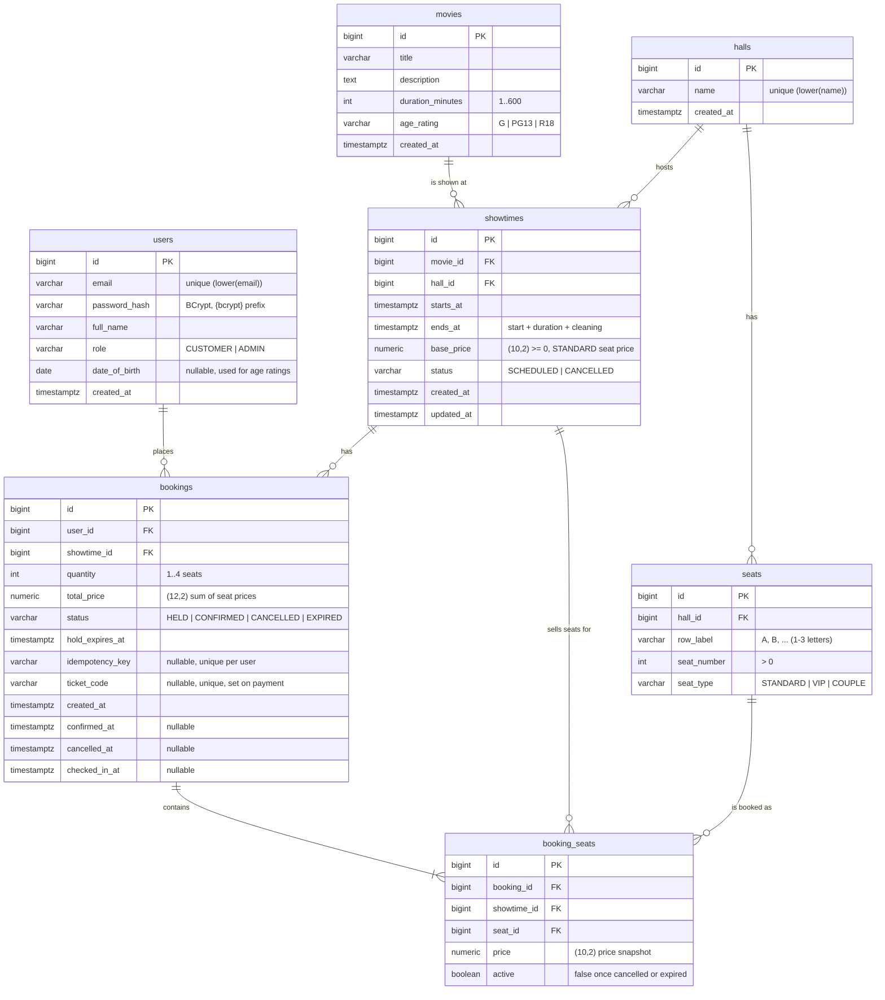
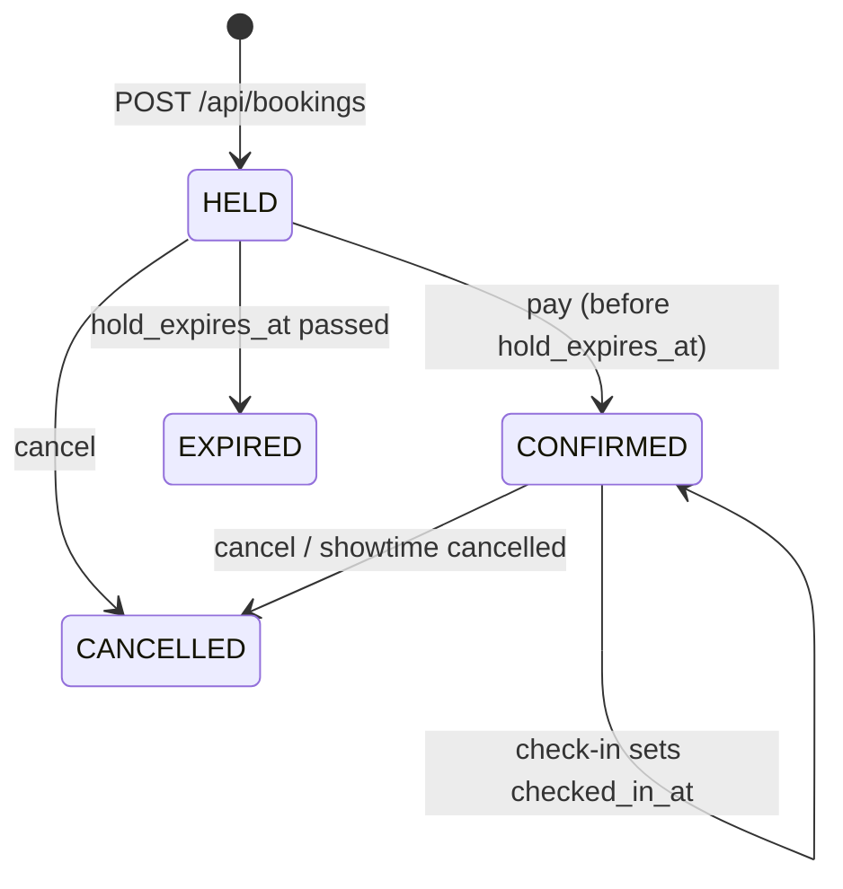

# Database

PostgreSQL (developed against 18). Flyway manages the schema from `src/main/resources/db/migration`. Hibernate runs with `ddl-auto: validate`: it checks that the entities match the tables, and the app fails to start if they don't. Hibernate never alters the schema.

## Entity-relationship diagram

## Tables

| Table | What a row is | Notes |
|---|---|---|
| `users` | A customer or admin account | `date_of_birth` is optional. It is set at registration and is needed to book PG13 and R18 movies. |
| `movies` | A film the cinema shows | `duration_minutes` and `age_rating` drive the showtime end time and the age check. |
| `halls` | A screening room | Created together with its seats in one request. Names are unique, ignoring case. |
| `seats` | One physical seat in a hall | Identified by `row_label` + `seat_number`, for example `F7`. `seat_type` sets the price multiplier: STANDARD ×1.00, VIP ×1.50, COUPLE ×2.00 (`SeatType`). |
| `showtimes` | One screening of a movie in a hall | `ends_at` is stored, not computed in queries: `starts_at + movie duration + cleaning time`. It is what the overlap constraint compares. |
| `bookings` | One customer's order for one showtime | Starts as `HELD` until `hold_expires_at`, becomes `CONFIRMED` on payment (gets a `ticket_code`), and ends as `CANCELLED` or `EXPIRED`. `checked_in_at` is set when staff scan the ticket. |
| `booking_seats` | One seat inside a booking | Keeps the price it was sold at. `showtime_id` is copied from the booking so the unique index below can use it. `active = true` means the seat is held or sold. |

There is no seat counter anywhere. A seat is taken when an active `booking_seats` row exists for it. The seat map and the "seats left" numbers are counted from these rows.

### Booking status

When a booking leaves `HELD` or `CONFIRMED`, its `booking_seats` rows are set to `active = false`, which frees the seats for other customers.

## Constraints

The most important rules are repeated as database constraints, so bad data is rejected even if application code is wrong:

| Table | Constraint | Protects |
|---|---|---|
| `users` | `UNIQUE INDEX ux_users_email ON users (lower(email))` | one account per email, case-insensitive |
| `users` | `CHECK (role IN ('CUSTOMER','ADMIN'))` | valid roles |
| `movies` | `CHECK (duration_minutes BETWEEN 1 AND 600)`, `CHECK (age_rating IN ('G','PG13','R18'))` | sane movies |
| `halls` | `UNIQUE INDEX ux_halls_name ON halls (lower(name))` | one hall per name, case-insensitive |
| `seats` | `UNIQUE (hall_id, row_label, seat_number)` (`ux_seats_position`) | no duplicate seat labels in a hall |
| `seats` | `CHECK (seat_number > 0)`, `CHECK (seat_type IN (...))` | valid seats |
| `showtimes` | `EXCLUDE USING gist (hall_id WITH =, tstzrange(starts_at, ends_at) WITH &&) WHERE (status = 'SCHEDULED')` (`ex_showtimes_hall_overlap`) | two scheduled showtimes never use the same hall at the same time, including cleaning time. Needs the `btree_gist` extension. |
| `showtimes` | `CHECK (ends_at > starts_at)`, `CHECK (base_price >= 0)`, `CHECK (status IN ('SCHEDULED','CANCELLED'))` | sane showtimes |
| `bookings` | `CHECK (quantity BETWEEN 1 AND 4)` | max 4 seats per booking |
| `bookings` | `CHECK (status IN ('HELD','CONFIRMED','CANCELLED','EXPIRED'))` | valid status |
| `bookings` | `UNIQUE (user_id, idempotency_key)` (`ux_bookings_idempotency`) | a retried request can't create a second booking. Scoped per user, so two users can use the same key. `NULL` keys never clash. |
| `bookings` | `UNIQUE (ticket_code)` (`ux_bookings_ticket_code`) | every ticket code is unique. `NULL` (unpaid) is allowed many times. |
| `booking_seats` | `UNIQUE INDEX ux_booking_seats_active ON booking_seats (showtime_id, seat_id) WHERE active` | **no double-selling:** a seat can be held or sold only once per showtime. Inactive (released) rows don't count, so a freed seat can be booked again. |
| `booking_seats` | `CHECK (price >= 0)` | sane prices |
| all | `FOREIGN KEY` on every `*_id` column | referential integrity |

Indexes: `ix_showtimes_movie_id`, `ix_showtimes_starts_at` (upcoming showtimes), `ix_bookings_user_id` ("my bookings"), `ix_bookings_showtime_status` (per-showtime limit and expiry queries) and `ix_booking_seats_booking_id`.

When a unique or exclusion constraint fires, the service turns the `DataIntegrityViolationException` into a 409 Conflict. This only happens in a race; the normal path checks first and returns a clearer message.

## Conventions

- Primary keys: `BIGINT GENERATED ALWAYS AS IDENTITY`, mapped to `GenerationType.IDENTITY`.
- Timestamps: `TIMESTAMPTZ` ↔ `java.time.Instant`. Hibernate is set to `jdbc.time_zone: UTC`. `date_of_birth` is a plain `DATE` ↔ `LocalDate`.
- Money: `NUMERIC` ↔ `BigDecimal`. Never use floating point for money.
- Enums are stored as strings (`@Enumerated(EnumType.STRING)`) with a matching `CHECK` constraint.
- Table names are plural and snake_case; column names are snake_case.

## Migrations

| Version | File | Description |
|---|---|---|
| V1 | `V1__init_schema.sql` | the whole cinema schema: enables `btree_gist`, creates `users` (with `date_of_birth`), `movies`, `halls`, `seats`, `showtimes`, `bookings` and `booking_seats`, with their constraints and indexes |

> **Upgrading a database from the old event model:** before the cinema model, V1 created `events` and `bookings`. The migrations were then squashed into this single V1, so Flyway rejects an old database (its V1 checksum no longer matches). Recreate it: `docker compose down -v`, or `DROP DATABASE … ; CREATE DATABASE …;` for `event_tickets` and `event_tickets_test`.

`btree_gist` is a trusted extension, so the database owner can create it without being a superuser. On a managed PostgreSQL service, check that the extension is allowed.

**Adding a change:** create `V2__short_description.sql` (the next number), update the entity, and run the app or the tests. **Never edit a migration that has already run** in any shared environment. Flyway checksums would fail. Always add a new version instead.

## Concurrency and locking

Seats are shared state that many customers compete for at once. The app uses **pessimistic row locks** on the showtime row, plus the partial unique index as a second guard.

| Operation | Locks (in order) | Query |
|---|---|---|
| Create booking (hold) | showtime row | `ShowtimeRepository.findByIdForUpdate` → `SELECT ... FROM showtimes WHERE id=? FOR UPDATE`, then expire this showtime's old holds, check, insert |
| Pay booking | showtime row → booking row | `BookingRepository.findShowtimeIdById` (no lock), then `ShowtimeRepository.findByIdForUpdate`, then `BookingRepository.findByIdForUpdate` |
| Cancel booking | showtime row → booking row | same as pay |
| Check in ticket | showtime row → booking row | `BookingRepository.findShowtimeIdByTicketCode` (no lock), then `ShowtimeRepository.findByIdForUpdate`, then `BookingRepository.findByTicketCodeForUpdate` |
| Update showtime | showtime row | `ShowtimeRepository.findByIdForUpdate` |
| Cancel showtime | showtime row → its booking rows | `ShowtimeRepository.findByIdForUpdate`, then `BookingSeatRepository.releaseAllForShowtime` and `BookingRepository.cancelAllForShowtime` (bulk `UPDATE`s) |
| Expire holds (`HoldExpiryJob`) | each showtime row → its booking rows | `ShowtimeRepository.findByIdForUpdate`, then `BookingSeatRepository.releaseExpiredHolds` and `BookingRepository.expireHolds` |

- Locks are held until the `@Transactional` service method commits.
- Concurrent writes for the **same** showtime run one at a time. Writes for **different** showtimes don't block each other.
- Every operation locks the **showtime row first**, then booking rows. With one lock order everywhere there's no cycle and no deadlock. `BookingApiIT.cancellingShowtimeWhileCustomersCancelNeverDeadlocks` checks this: if the booking is locked before the showtime, it fails with `deadlock detected`.
- **Two guards against double-selling.** The showtime lock makes "check seats free, then insert" atomic. If a code path ever forgot the lock, `ux_booking_seats_active` would still reject the second insert. `BookingApiIT.concurrentBookingsSellEachSeatOnce` races 20 customers for the same 2 seats: exactly 1 succeeds and exactly 2 active seat rows exist.
- Creating a showtime takes no lock: there is no row yet. Two admins scheduling the same hall at once are stopped by `ex_showtimes_hall_overlap`.

### Expired holds

An unpaid hold stops counting the moment `hold_expires_at` passes, even before any row is updated:

1. **Queries:** `BookingSeatRepository.TAKEN` treats a seat as taken only if its booking is `CONFIRMED`, or `HELD` with `hold_expires_at > now`. Seat maps, counts and the "seats free" check all use it. `Booking.statusAt(now)` shows such a booking as `EXPIRED` in responses.
2. **On booking:** creating a booking first expires the showtime's old holds in the database (under the showtime lock), so their `active` rows don't block the unique index.
3. **Sweep:** `HoldExpiryJob` runs every `app.booking.expiry-sweep-interval` (default `PT1M`) and marks old holds `EXPIRED` and their seats inactive. This only keeps the rows tidy; correctness doesn't depend on it.

**Why not optimistic locking (`@Version`)?** Optimistic locking would make concurrent bookings for a popular showtime fail and need retries. Row locks make them queue instead, which suits this hot path.

## Bootstrap data

There is no seed data in migrations. On startup, `AdminAccountInitializer` creates the admin user from `app.admin.*` if no user with that email exists. Movies, halls (with seats) and showtimes are created through the API.
