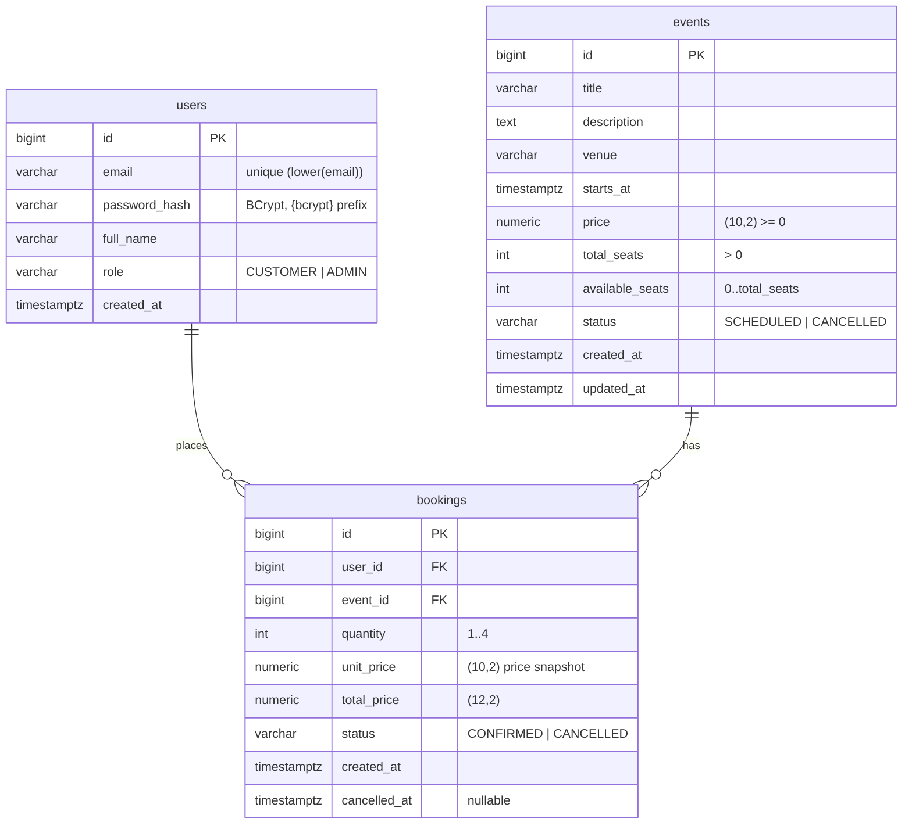

# Database

PostgreSQL. Flyway manages the schema from `src/main/resources/db/migration`. Hibernate runs with `ddl-auto: validate`: it checks that the entities match the tables, and the app fails to start if they don't. Hibernate never alters the schema.

## Entity-relationship diagram

## Constraints

The business rules are repeated as database constraints, so bad data is rejected even if application code is wrong:

| Table | Constraint | Protects |
|---|---|---|
| `users` | `UNIQUE INDEX ux_users_email ON users (lower(email))` | one account per email, case-insensitive |
| `users` | `CHECK (role IN ('CUSTOMER','ADMIN'))` | valid roles |
| `events` | `CHECK (available_seats BETWEEN 0 AND total_seats)` | rule 01: no overbooking; rule 02: seats stay correct |
| `events` | `CHECK (price >= 0)`, `CHECK (total_seats > 0)` | sane events |
| `events` | `CHECK (status IN ('SCHEDULED','CANCELLED'))` | valid status |
| `bookings` | `CHECK (quantity BETWEEN 1 AND 4)` | rule 03: max 4 per booking |
| `bookings` | `FOREIGN KEY user_id → users`, `event_id → events` | referential integrity |
| `bookings` | `CHECK (status IN ('CONFIRMED','CANCELLED'))` | valid status |

Indexes: `ix_bookings_user_id` (the "my bookings" query) and `ix_bookings_event_id`.

## Conventions

- Primary keys: `BIGINT GENERATED ALWAYS AS IDENTITY`, mapped to `GenerationType.IDENTITY`.
- Timestamps: `TIMESTAMPTZ` ↔ `java.time.Instant`. Hibernate is set to `jdbc.time_zone: UTC`.
- Money: `NUMERIC` ↔ `BigDecimal`. Never use floating point for money.
- Enums are stored as strings (`@Enumerated(EnumType.STRING)`) with a matching `CHECK` constraint.
- Table names are plural and snake_case; column names are snake_case.

## Migrations

| Version | File | Description |
|---|---|---|
| V1 | `V1__init_schema.sql` | users, events, bookings tables, constraints, indexes |

**Adding a change:** create `V2__short_description.sql` (the next number), update the entity, and run the app or the tests. **Never edit a migration that has already run** in any shared environment. Flyway checksums would fail. Always add a new version instead.

## Concurrency and locking

Seat counts are shared state that many users change at once. The app uses **pessimistic row locks**:

| Operation | Locks (in order) | Query |
|---|---|---|
| Create booking | event row | `EventRepository.findByIdForUpdate` → `SELECT ... FROM events WHERE id=? FOR UPDATE` |
| Cancel booking | booking row → event row | `BookingRepository.findByIdForUpdate`, then `EventRepository.findByIdForUpdate` |
| Update / cancel event | event row | `EventRepository.findByIdForUpdate` |

- Locks are held until the `@Transactional` service method commits.
- Concurrent requests for the **same** event are processed one at a time. Requests for **different** events don't block each other.
- No operation locks an event and then a booking, so there's no lock-order cycle and no deadlock.

**Why not optimistic locking (`@Version`)?** Optimistic locking would make concurrent bookings for a popular event fail and need retries. Row locks make them queue instead, which suits this hot path.

## Bootstrap data

There is no seed data in migrations. On startup, `AdminAccountInitializer` creates the admin user from `app.admin.*` if no user with that email exists. Events are created through the API.
