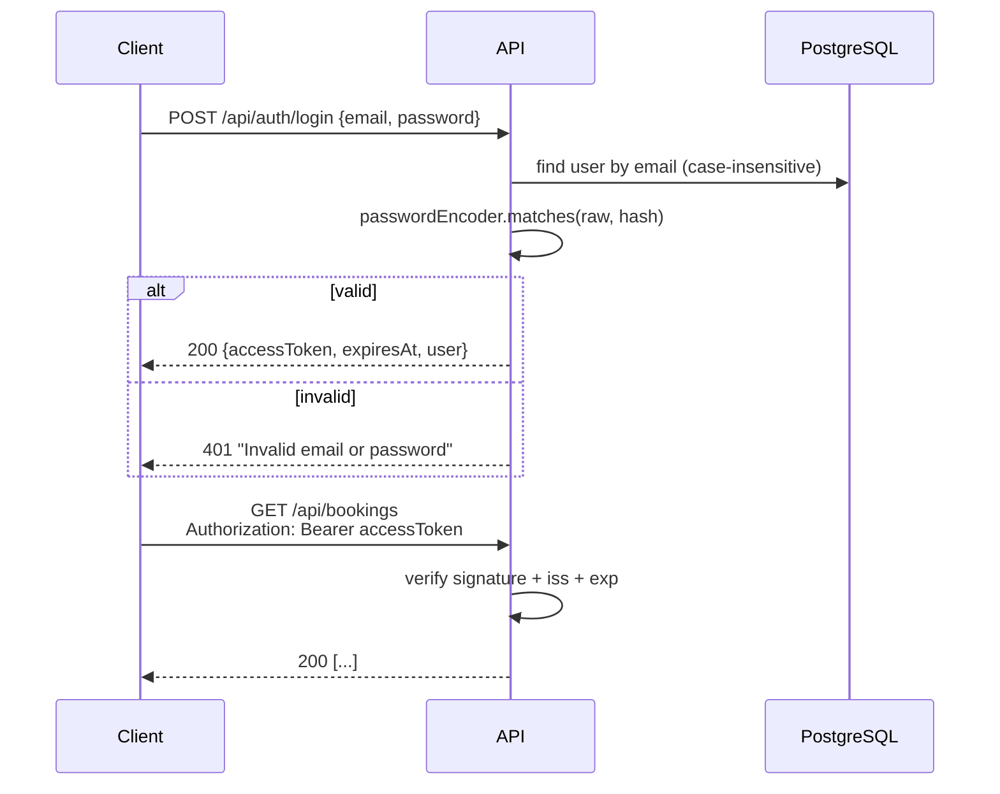

# Security

## Overview

- **Stateless.** No HTTP session. Every request carries a JWT.
- **Self-issued tokens.** The app signs tokens with HMAC-SHA256 (`HS256`) using `app.jwt.secret`, and verifies them with Spring Security's OAuth2 resource server (`NimbusJwtDecoder`).
- **Passwords** are hashed with BCrypt through Spring's `DelegatingPasswordEncoder`. Hashes are stored with a `{bcrypt}` prefix, so the algorithm can be upgraded later.
- **CSRF is disabled.** This is safe because the API uses bearer tokens, not cookies.

All of this is configured in `config/SecurityConfig.java`.

## Login flow

## Token format

Header: `{"alg": "HS256"}`

Claims:

| Claim | Example | Meaning |
|---|---|---|
| `iss` | `event-tickets` | must equal `app.jwt.issuer`, checked on every request |
| `sub` | `"2"` | user ID: the **only** source of the caller's identity |
| `email` | `alice@example.com` | informational |
| `role` | `CUSTOMER` | mapped to the authority `ROLE_CUSTOMER` |
| `iat` / `exp` | epoch seconds | lifetime is `app.jwt.expiration` (default 1 hour) |

Controllers read the token with `@AuthenticationPrincipal Jwt jwt` and convert it to a `CurrentUser(id, email, role)` record. Services receive this record, so business code doesn't depend on Spring Security.

> **Role changes take effect at the next login.** The role is stored in the token, so a token issued before a role change keeps the old role until it expires.

## Roles

| Role | How it's created | Can do |
|---|---|---|
| `CUSTOMER` | `POST /api/auth/register` | view events; create, view and cancel **their own** bookings |
| `ADMIN` | on startup from `app.admin.*` (`AdminAccountInitializer`) | everything a customer can do, plus create, update and cancel events and view or cancel **any** booking |

## Authorization rules

These are checked in two places.

**1. URL rules** (`SecurityConfig`), evaluated in order:

| Rule | Access |
|---|---|
| `POST /api/auth/register`, `POST /api/auth/login` | permitAll |
| `/actuator/health/**`, `/error` | permitAll |
| `GET /api/events`, `GET /api/events/*` | permitAll |
| `/api/events/**` (all other methods) | `hasRole("ADMIN")` |
| everything else | authenticated |

**2. Ownership rule** (`BookingService.checkAccess`): a customer may only read or cancel a booking whose `user_id` equals their token's `sub`. Otherwise the response is 403. See [business rule 06](business-rules.md#06-only-your-own-bookings).

## Production checklist

- [ ] Set `JWT_SECRET` to a long random value (at least 32 characters). For example: `openssl rand -base64 48`. The default in `application.yml` is **for development only**.
- [ ] Set `ADMIN_PASSWORD` (and ideally `ADMIN_EMAIL`) to non-default values.
- [ ] Use a dedicated database user with limited privileges instead of `postgres`.
- [ ] Serve the API over HTTPS only (TLS at the load balancer or reverse proxy).
- [ ] Consider adding rate limiting on `/api/auth/login`.
- [ ] Consider refresh tokens or a shorter `JWT_EXPIRATION` if long sessions are needed.

> **Secret rotation:** changing `JWT_SECRET` immediately invalidates all issued tokens, and every user has to log in again.
