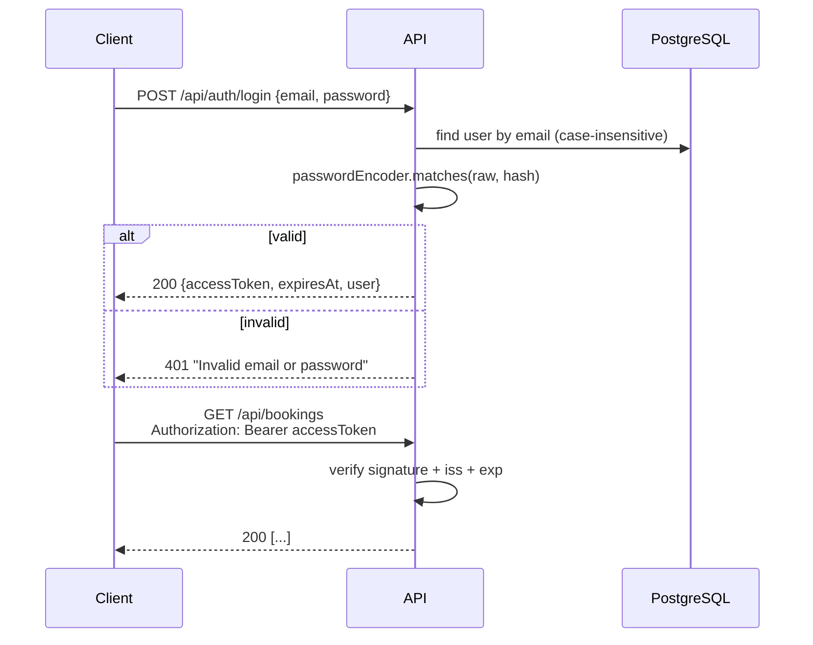

# Security

## Overview

- **Stateless.** No HTTP session. Every request carries a JWT.
- **Self-issued tokens.** The app signs tokens with HMAC-SHA256 (`HS256`) using `app.jwt.secret`, and verifies them with Spring Security's OAuth2 resource server (`NimbusJwtDecoder`).
- **Passwords** are hashed with BCrypt through Spring's `DelegatingPasswordEncoder`. Hashes are stored with a `{bcrypt}` prefix, so the algorithm can be upgraded later.
- **CSRF is disabled.** This is safe because the API uses bearer tokens, not cookies.

All of this is configured in `config/SecurityConfig.java`.

## Login flow

## Token format

Header: `{"alg": "HS256"}`

Claims:

| Claim | Example | Meaning |
|---|---|---|
| `iss` | `event-tickets` | must equal `app.jwt.issuer`, checked on every request |
| `sub` | `"2"` | user ID: the **only** source of the caller's identity |
| `email` | `alice@example.com` | informational |
| `role` | `CUSTOMER` | mapped to the authority `ROLE_CUSTOMER` |
| `iat` / `exp` | epoch seconds | lifetime is `app.jwt.expiration` (default 1 hour) |

Controllers read the token with `@AuthenticationPrincipal Jwt jwt` and convert it to a `CurrentUser(id, email, role)` record. Services receive this record, so business code doesn't depend on Spring Security.

> **Role changes take effect at the next login.** The role is stored in the token, so a token issued before a role change keeps the old role until it expires.

## Roles

| Role | How it's created | Can do |
|---|---|---|
| `CUSTOMER` | `POST /api/auth/register` (always CUSTOMER, whatever the body says) | browse movies, halls, showtimes and seat maps; hold, pay, view and cancel **their own** bookings |
| `ADMIN` | on startup from `app.admin.*` (`AdminAccountInitializer`) | everything a customer can do, plus manage movies, halls and showtimes, check tickets in at the door, and view or cancel **any** booking (also inside the cancel cutoff) |

## Endpoint access

| Method | Path | Public | Customer | Admin |
|---|---|---|---|---|
| POST | `/api/auth/register`, `/api/auth/login` | ✓ | ✓ | ✓ |
| GET | `/api/auth/me` | | ✓ | ✓ |
| GET | `/actuator/health` | ✓ | ✓ | ✓ |
| GET | `/api/movies`, `/api/movies/{id}` | ✓ | ✓ | ✓ |
| POST / PUT | `/api/movies`, `/api/movies/{id}` | | | ✓ |
| GET | `/api/halls`, `/api/halls/{id}` | ✓ | ✓ | ✓ |
| POST | `/api/halls` | | | ✓ |
| GET | `/api/showtimes`, `/api/showtimes/{id}`, `/api/showtimes/{id}/seats` | ✓ | ✓ | ✓ |
| POST / PUT | `/api/showtimes`, `/api/showtimes/{id}`, `/api/showtimes/{id}/cancel` | | | ✓ |
| POST | `/api/bookings` | | ✓ | ✓ |
| GET | `/api/bookings` | | own bookings | all bookings |
| GET | `/api/bookings/{id}` | | own only | any |
| POST | `/api/bookings/{id}/pay` | | own only | any |
| POST | `/api/bookings/{id}/cancel` | | own only, not within the cancel cutoff once paid | any, any time before check-in |
| POST | `/api/tickets/{code}/check-in` | | | ✓ |

No token (or an invalid one) on a protected path gives **401**. A valid token with the wrong role gives **403**.

## Authorization rules

These are checked in two places.

**1. URL rules** (`SecurityConfig`), evaluated in order:

| Rule | Access |
|---|---|
| `POST /api/auth/register`, `POST /api/auth/login` | permitAll |
| `/actuator/health/**`, `/error` | permitAll |
| `GET /api/movies/**`, `GET /api/halls/**`, `GET /api/showtimes/**` | permitAll |
| `/api/movies/**`, `/api/halls/**`, `/api/showtimes/**`, `/api/tickets/**` (all other methods) | `hasRole("ADMIN")` |
| everything else (including `/api/bookings/**` and `/api/auth/me`) | authenticated |

**2. Service-level rules**

- **Ownership** (`BookingService.checkAccess`): a customer may only view, pay or cancel a booking whose `user_id` equals their token's `sub`. Otherwise the response is 403. Admins pass this check. The list endpoint returns only the caller's own bookings for customers.
- **Age rating** (`BookingService.checkAge`): for PG13 and R18 movies, the customer's age is computed from the **date of birth stored on their account** (`users.date_of_birth`, given at registration), on the showtime's local date in `app.cinema.time-zone`. The client can't send an age or date of birth with the booking. No stored date of birth, or too young → 403.
- **Idempotency keys are scoped per user.** The `Idempotency-Key` header is looked up together with the caller's user ID, and the database enforces `UNIQUE (user_id, idempotency_key)`. Another user sending the same key gets their own new booking; they can never read or replay someone else's booking through a guessed key. A key reused for a different showtime → 409.
- **Prices are never taken from the client.** `BookingRequest` has no price field; totals are computed from the showtime's base price and seat types.

See [business-rules.md](business-rules.md) for the full list of booking rules.

## Production checklist

- [ ] Set `JWT_SECRET` to a long random value (at least 32 characters). For example: `openssl rand -base64 48`. The default in `application.yml` is **for development only**.
- [ ] Set `ADMIN_PASSWORD` (and ideally `ADMIN_EMAIL`) to non-default values.
- [ ] Use a dedicated database user with limited privileges instead of `postgres`. It needs to own the schema (or have `btree_gist` created for it) for the Flyway migrations.
- [ ] Serve the API over HTTPS only (TLS at the load balancer or reverse proxy).
- [ ] Consider adding rate limiting on `/api/auth/login` and `POST /api/bookings` (holding seats costs nothing, so a script could hold seats repeatedly; the per-customer limit and the hold expiry limit the damage).
- [ ] Consider refresh tokens or a shorter `JWT_EXPIRATION` if long sessions are needed.

> **Secret rotation:** changing `JWT_SECRET` immediately invalidates all issued tokens, and every user has to log in again.
